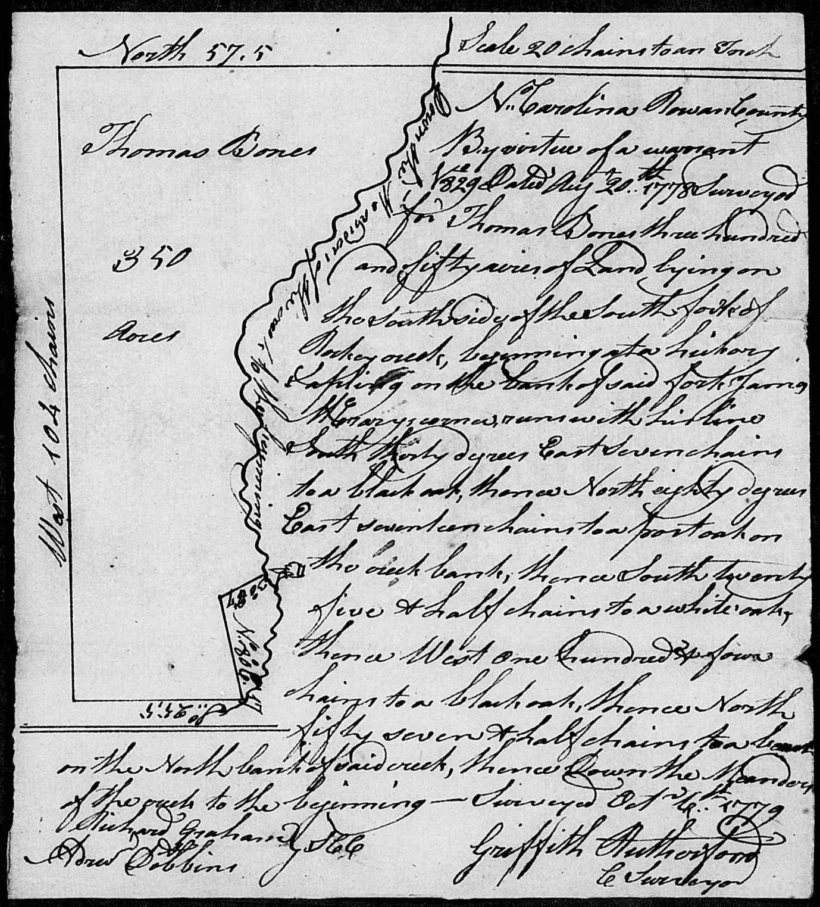

:icons: font
:doctype: book
:hardbreaks:
:TOC:
:toclevels: 4
:media: prepress
:sectnums:

== Bone Surname in Iredell & Rowan County North Carolina
=== The Records

==== 1765 John Bone appointed Constable
.Rowan County Court of Pleas and Quarter Sessions Minutes; vol 2; pg 604, 1765-07-13
[page] 604
Constables Appointed to Warn in the Taxable for the Several District and Justices to Rec^d^ them

[%autowidth,options="header"]
|=======
| | Constables | Districts | Justices
| iss^d^ | Henry Horah | Cap^n^ Michael | John Dunn
| iss^d^ | *John Bone* | D^o^ D^o^ | Alex^r^Martin
|=======

==== 1765 John Bone appointed Constable
.Rowan County Court of Pleas and Quarter Sessions Minutes, 1765-01-xx
[page] 561
Constables appointed for the Year 1765
...
iss^d^ *John Bone* in Capt^n^ Michael District

==== 1766 John Bone vs John Buntin
.Rowan County Court of Pleas and Quarter Sessions Minutes; Vol 2; Pg 664, 1766-10-xx
*John Bone* vs John Buntin }
The Same Jury as Above - find a Virdct for _ £
[margin note] ?
https://www.familysearch.org/ark:/61903/3:1:3QS7-89G4-QFMC?i=383&cat=353264[View images at FamilySearch.org]

==== 1767 John Bone Constable
.Rowan County Court of Pleas and Quarter Sessions Minutes; Vol 2; Pg 677, 1767-01-15
[page] 677
Constables
...
*John Bone* in the room of Henry Horah for the Town & Liberty of Salisbury &c
https://www.familysearch.org/ark:/61903/3:1:3QS7-89G4-QXKS?i=393&cat=353264[View images at FamilySearch.org]

==== 1767 John Bone to David Craige
.Rowan County Court of Pleas and Quarter Sessions Minutes; Bk 2, Pg 700, 1767-04-18
A Bill of Sale from *John Bone* To David Craige for A Brown Cow marked With a Crop in the Left Ear and a swallowfork in the Righ one pide Calf belonging to s^d^ Cow & one Sorral mare Brand on the near sid thus ? Sholder & Buttock and A blase in the Face Trots Naturily & and all the housegoods and Chattles Now Belong to S^d^ Bone &c
Acknowledged in Open Court
https://www.familysearch.org/ark:/61903/3:1:3QS7-89G4-QXVQ?i=404&cat=353264[View images at FamilySearch.org]

==== 1768 John Bone vs The King, Court Case
.Rowan County Court of Pleas and Quarter Sessions Minutes; Bk 3, Pg 24, 1768-04-21
The King vs *John Bone* & his Wife } Petty Larceny
The Same Jury as in No 68. Swon and find

[%autowidth,options="header"]
|=======
|Evidence|
|Rob. Pearis|K
|Eliz Pearis|K
|Cath Foley|P
|Fred. Long|P
|Hen Page|P
|John L Beard|P
|John Holand|P
|Jen Horah|K
|=======

https://www.familysearch.org/ark:/61903/3:1:3QS7-89G4-QXGM?i=447&cat=353264[View document at FamilySearch.org]

==== 1768 John Bone Jr. from Hugh Foster
.Rowan County Court of Pleas and Quarter Sessions Minutes; Bk 3, Pg 28, 1768-04-23
A Deed from Hugh Foster To *John Bone Jun^r^* for One Lot of Land in the North Square N^o^ 36. Acknowledged in Open Court
[margin note] p^d
https://www.familysearch.org/ark:/61903/3:1:3QS7-89G4-QXXV?i=449&cat=353264[View document at FamilySearch.org]

==== 1768 John Bone Sr. from Hugh Foster
.Rowan County Court of Pleas and Quarter Sessions Minutes; Bk 3, Pg 28, 1768-04-23
A Deed from Hugh Foster to *John Bone Sen^r^* for 3 Lots in the North Square N^o^ 35 & 43 & 44 Dated the 21 Day of April 1768 Acknowledged in Open Court
[margin note] p^d
https://www.familysearch.org/ark:/61903/3:1:3QS7-89G4-QXXV?i=449&cat=353264[View document at FamilySearch.org]

---
==== 1769 John Bone to Robert Derumple
.Rowan County Court of Pleas and Quarter Sessions Minutes; Bk. 3, Pg. 99, 1769-05-10
A deed from *John Bone* and his Wife to Robert Derumple for One Lot in Salisbury NO. 35 in the North Square date the 13^t^ day of August 1768 and proved by Maxwell Chambers in Open Court
https://www.familysearch.org/ark:/61903/3:1:3QS7-89G4-QXLF?i=486&cat=353264[View document at FamilySearch.org]

---
==== 1770 John Bone vs Peter Johnston - Court Case
.Rowan County Court of Pleas and Quarter Sessions Minutes; Bk 3, Pg 212, 1770-08-16
*John Bone* vs Peter Johnston } T.A.B. N^o^ 37. 24. 21. N^o^ 42
1 Macom Blue 2 John Biggerstaff 3 Elias Turner 5 James Dobbins 6 Harmon Butner
Edward Pool 7 William Naul 8 Vincent Williams 9 Robert Barkley 10 Thomas Bryan 11 Will. Witacre 12

---
==== 1771 John Bone replaced as Constable
.Rowan County Court of Pleas and Quarter Sessions Minutes; Bk 3, Pg 276, 1771-08-05
Bartholemew Lewis Coffer Appointed Constable for the Town of Salisbury, Orders of the Court that *John Bone* do Act no Longer and that he deliver up all all his papers & to Lewis Coffer who App^d^ in Open Court and Quallifyed.
https://www.familysearch.org/ark:/61903/3:1:3QS7-89G4-QXHG?i=580&cat=353264[View images at FamilySearch.org]

---
==== 1774 Henry Bone Deed recorded
.Rowan County Court of Pleas and Quarter Sessions Minutes, 1774-08-05
[page] 41
Deeds proved in Open Court and Ordered to be Registered
...
A Deed from *Henry Bone Jun^r^* & Eliz^th^ his wife to Lawrence Lingle 220 acres dated the 1^st^ day of March 1773 proved by the Oath of Windle Miller.
https://www.familysearch.org/ark:/61903/3:1:3QS7-89G4-QSWM-8?i=28&cat=353264[View images at FamilySearch.org]

---
==== 1778 James Bone adjacent John Lard Survey
.Rowan County Land Entries 1778*, 1778-02-21
Abstract: 463. Feb. 21, 1778 John Lard enters 640 acres in Rowan Co on S Yadkin River; bordering James Beaty, *James Bone*, John Nichols, & widow Traves.

==== 1778 James Bone adjacent John Joshua Nichols Jr.
.Rowan County Land Entries 1778, 1778-03-10
Abstract: 571. Mar. 10, 1778 Joshua Nichols Jr. enters 400 acres in Rowan County on both sides of Rocky Creek; bordering Benjamin Dobson, *James Bone*, John Lard, widow Travis and Joseph Nicholas claims.

==== 1778 William Bone adjacent John Joshua Nichols Jr.
.Rowan County Land Entries 1778, 1778-03-10
Abstract: 572. " 75 a added Mar. 10, 1778 Andrew Kilpatrick enters 350 acres in Rowan County on South Yadkin River; bordering *William Bone's* NE corner and N by said river; includes his own improvement.

---
==== 1778 Thomas Bone Land Entry
*1778-08-20*
*NC Secretary of State Land Grant Files, File No. 3090*
No 829 James Brandon Entry officer of Claims for lands within the county of Rowan
To the Surveyor of said County Greeting
You are hereby required to lay off and Survey for Thomas Bones a tract of land Containing 350 acres lying in the County aforesaid on the South and Middle fork of Rocky creek Joining James McCrery being half of the tract the said James McCrery lives on formerly Surveyed for William Archiblad
Observing teh directions of the act of Assembly in such case made and provided two Just and fair plans of such Survey with a proper Certificate annexed to each Together with this Warrant you are to transmit to the Secretarys office without delay Geven under my hand at Salisbury the twentyeth day of August 1778 Ja^s^ Brandon

---
==== 1778 Thomas Bone's Land Entry
*1778-05-20*
*Rowan County NC Land Entries Vol 1*
N^o^ 829 Thomas Bone Enters 350 Acres of Land in Rowan County on the South and Middle fork of Rockey Creek Joining James McCrary Being half of the Said Tract the Said McCrary Lives on formerly Surveyed for Will^m^ Archibald
May 20^th^ 1778
https://www.familysearch.org/ark:/61903/3:1:3QS7-89DH-G4LV?i=81&cat=353082[View Record at FamilySearch.org]

---
==== 1778 Thomas Bone mentioned in land entry
*1778-05-20*
*Rowan County NC Land Entries Vol 1*
N^o^ 828 James McCrery Enters 350 Acres of Land in Rowan County on the South and Middle fork of Rockey Creek Joining Thomas Bone Being Half of the Said Tract the Said Bones Lives on formerly Surveyed for William Archibald
May 20^th^ 1778
https://www.familysearch.org/ark:/61903/3:1:3QS7-89DH-G4LV?i=81&cat=353082[View Record at FamilySearch.org]

---
==== 1778 James Bone Entry and mention Thomas Bone
*1778-06-17*
*Rowan County NC Land Entries Vol 1*
N^o^ 923 James Bones Enters 100 Acres of Land in Rowan County on the Waters of Rockey Creek Bounded by a Conditional Line made by Arbitration Between Robert Boyd and Thomas Bones, up and Down the Waters
June 17^th^ 1778

---
==== 1778 John Bone Survey
*1778-10-06 230 acres*
*North Carolina Land Grants Rowan #728*
*File No. 669, Grant No. 81, Issued 3/21/1780, Entry No. 728*

STATE of NORTH-CAROLINA. No. 728
JAMES BRANDON, Entry Officer of Claims for Lands in the County of Rowan.
To the SURVEYOR of the said County, Greeting. YOU are hereby required, as soon as may be, to lay off and survey, for *John Bone* a Tract or Parcel of Land, containing Two Hundred and thirty Acres, lying in the County aforesaid, on the Midle fork of Rockey Creek and on both Sides of Said Creek bounded by James McCrary on the South Side and John Dobbins on the East, Vacant on the Other points
Observing the Directions of the Act of Assembly in such Case made and provided for running out Lands. Two just and fair Plans of such Survey, with a proper Certificate annexed to each, you are to transmit, with this Warrant, to the Secretary's Office without Delay.
GIVEN under my Hand at Salisbury the Sixth Day of August Anno Dom. 1778 Ja^s^ Brandon

State of North Carolina Rowan County }
By Virtue of a Warrant N^o^ 728 surveyed a Tract of land containing two hundred thirty Acres for *John Bones* lying on Both sides of the middle Fork of Rocky Creek. Beginning at a Black oak oak [sic] runs West forty seven chains to a Pine North forty nine chains to a Pine. East forty seven chains to a Black oak on John Dobins line. Thence South to the Beginning Surveyed October 6^th^ 1778 by Griffith Rutherford C.S.
Richard Graham & }
Andrew Dobins }
Chain Bearers }

https://www.ancestry.com/interactive/60621/44173_355583-00958?pid=122363&backurl=https://search.ancestry.com/cgi-bin/sse.dll?_phsrc%3DKcF1%26_phstart%3DsuccessSource%26usePUBJs%3Dtrue%26indiv%3D1%26db%3Dnclandgrants%26gsln%3DBone%26gsfn_x%3DNN%26new%3D1%26redir%3Dfalse%26uidh%3Dbz5%26gss%3Dangs-d%26rank%3D1%26pcat%3D36%26fh%3D13%26h%3D122363%26recoff%3D9%252021%26ml_rpos%3D14&treeid=&personid=&hintid=&usePUB=true&_phsrc=KcF1&_phstart=successSource&usePUBJs=true[View record at Ancestry.com]

---
==== 1778 James Bone Survey
*1778-10-07 Survey 335 acres*
*North Carolina Land Grants Rowan #725*

STATE of NORTH-CAROLINA. No. 725
JAMES BRANDON, Entry Officer of Claims for Lands in the County of Rowan.
To the SURVEYOR of the said County, Greeting. YOU are hereby required, as soon as may be, to lay off and survey, for *James Bone* a Tract or Parcel of Land, containing five Hundred Acres, lying in the County aforesaid. Joining on the South Side of the South Rockey Creek. Joining lands Claimed by Joshua Nicholls & John Callihan bounded by lines formerly Run by William Sharp for John Hankins
Observing the Directions of the Act of Assembly in such Case made and provided for running out Lands. Two just and fair Plans of such Survey, with a proper Certificate annexed to each, you are to transmit, with this Warrant, to the Secretary's Office without Delay.
GIVEN under my Hand at Salisbury the Sixth Day of August Anno Dom. 1778 Ja^s^ Brandon

State of North Carolina Rowan County }
By Virtue of a Warrant N^o^ 725 surveyed a Tract of Land for *James Bones* containing Three hundred and thirty five Acres lying on the South side of South Rocky creek Beginning at a Gum on the bank of the Creek runs South sixty seven chains and fifty Links to a Post Oak West fifty six chains and fifty links to a Post Oak on Joshua Nicholl's Line. Thence North fifty one chains to a Crab Tree on The Creek binds Thence along the Meanders of the Creek to the Beginning. Surveyed October 7^th^ Day 1778 by
Griffith Rutherford C.S.

Richard Graham & }
*John Bones* }
Chain Bearers }

https://www.ancestry.com/interactive/60621/44173_355583-00967?pid=122365&backurl=https://search.ancestry.com/cgi-bin/sse.dll?_phsrc%3DKcF1%26_phstart%3DsuccessSource%26usePUBJs%3Dtrue%26indiv%3D1%26db%3Dnclandgrants%26gsln%3DBone%26gsfn_x%3DNN%26new%3D1%26redir%3Dfalse%26uidh%3Dbz5%26gss%3Dangs-d%26rank%3D1%26pcat%3D36%26fh%3D12%26h%3D122365%26recoff%3D9%26ml_rpos%3D13&treeid=&personid=&hintid=&usePUB=true&_phsrc=KcF1&_phstart=successSource&usePUBJs=true#?imageId=44173_355583-00967[View document at Ancestry.com]

---
==== 1779 Thomas Bone Survey
*1779-10-06*
*NC Secretary of State Land Grant Files, File No. 3090*
\N. Carolina Rowan County
By virtue of a warrant N^o^ 829 Dated Aug^t^ 20^th^ 1778 Surveyed for Thomas Bones three hundred and fifty acres of Land lying on the south side of the South fork of Rockey creek, beginning at a hickory sapling on the bnak of said fork james McCrarys corner runs with his line South thirty degrees East Seven chains to a black oak, thence North eighty degrees East seventeen chains to a post oak on the creek bank, thence South twenty five & half chains to a white oak thence West one hundred and four chains to a black oak, thence North fifty seven & half chains to a beech on the North bank of said creek, thence Down the Meanders of the creek to the beginning - Survyed Oct^r^ 6^th^ 1779
[.right]
Griffith Rutherford C Surveyor

[.float-group]
--
[.left]
Richard Grahahm}
Adrew Dobbins } SCC
--

[Back] Thomas Bones Warrant & Plan for 350 Acres Aug 20^th^ 1778

https://www.familysearch.org/ark:/61903/3:1:3QS7-89WK-7SS?i=1413&cat=695114[View document at FamilySearch.org]

---
==== William Bone - Will original
*1787-07-10*
*North Carolina Probate Records*
In the name of God Amen
I *William Bone* of the County of Rowan and State of North Carolina, being in perfect mind and memory, blessed be God, do this tenth day of July in the year of our Lord one thousand seven hundred and eighty seven, make and publish this my last Will and Testament in manner following, That is to say, first -
I give, bequeath and devise unto my son *William* all that tract or parcel of land with my mansion house and all the improvements where I now live, in fee simple, upon this express condition that my s^d^ son *William* pay or cause to be paid, the following mentioned sums of money unto the several persons herein next mentioned, within twelve months after my decease, namely to my son *James* twenty pounds. To my daughter *Esther Brotherton* twenty pounds. To my daughter *Susanna McCurdy* twenty pounds.
The residue of my estate I give and bequeath to my four sons only *James, Thomas, William and John*, to be sold and equally divided among them.
And I make and ordain my son *William Bone* and my trusty friend Andrew Killpatrik the whole and sole executors of this my last Will and Testament, utterly disallowing revoking and disannulling all former Wills legacies and bequests by me heretofore made, ratifying and confirming this and no other to be my last Will and Testament,
In witness whereof I the s^d^ *William Bone* have to this my last Will and and Testament set my hand and seal the day and year above written
[.right]
*William X Bone* (seal)
[.float-group]
--
[.left]
Signed sealed published and pronounced in the presence of }
Andrew Killpatrick }
Francis Johnston } Jurat
*William Bone* }
--
\[back]
William Bones
last Will & Testment ? 1789
A Page 73
July 10 - 1787
W^m^ T. [sic] Bone

[NOTE]
Research note: This William Bone matches William Bone III (B) in Dr. Robert G. Bone's history. There is an 1826 will for William Bone likely IV
Check signature of the two wills

---
==== 1788 Hugh Bone from Daniel Boyd 210 acres
.Rowan Deed Book A, Pg. 167-169, 1788-09-05
This Indenture made this 5^th^ day of September in the Year of our Lord one thousand seven hundred and eighty Eight between Daniel Boyd of the County of Rowan and State of North Carolina of the one part and *Hugh Bone* of the same County and State of the other part Witnesseth that for & in consideration of the Sum of Sixty five pounds to the said Daniel Boyd in hand paid by the said Hugh Bone at and before the ensealing and delivery of these presents the receipt and payment whereof is hereby acknowledged hath granted Bargained Sold aliened Enfeofed conveyed and Confirmed and by these presents doth bargain sell enfeof and Confirm Unto the said Hugh Bone his heirs and assigns forever all that Messuage or tract of land lying and being in the County afforesaid on the middle fork of rockey Creek Beginning at a stake on the South side of the said creek it being also John Welches upper corner thence North sixty five West one hundred and twenty poles to a pine thence North fifty five East one hundred and Eighty poles crossing the Creek to a pine thence south sixty five East one hundred & Sixty four poles to a post oak West forty two South one hundred and thirty poles to a pine
on the bank of the Branch thence down the Various courses of the Branch bearing about West sixteen South sixty poles to a white oak on the bank of the creek thence to the beginning it being a parcel containing the whole two hundred and ten Acres of land be the same less or more of and Subdivided from a tract of four hundred and twenty acres

[page] 168
Origionally granted to the said Daniel Boyd bearing date the tenth day of October in the year of our Lord one thousand seven hundred and Eighty three With the Appurtenances situate lying and being as afforesaid with their and every of their rights members and Appurtenances whatsoever and the reversions remainder & remainders of all and singular the land tenement and premises hereby granted or intended to be granted and of every part and ? of them and all rents Issues servise and profit of them or any of them belonging or Appertaining and also all and every the Estate and Estates rights titles claim interests and demands whatever of him the said Daniel Boyd of or into the S^d^ land tenements hereditaments and premises To have and to hold the said Land tenements hereditaments and premises hereby granted with their Appurtenances to the said Hugh Bone his heirs and assigns to the only proper sue & behoof of the said Hugh Bone his heirs and assigns forever and the said Daniel Boyd for himself his heirs Executors and Administrators doth hereby promise Covenant & agree that he the said Daniel Boyd his heirs Executors and Administrators shall and will at all times warrant and forever defend the said premises to the Said Hugh Bone his heirs and assigns against all lawful Claims or demands contrary to the true intent and meaning of these presents in Witness whereof the said Daniel Boyd has hereunto set his and Seal the day and Year first above written
[.right]
Daniel Boyd (seal)

[page] 169
Sealed and Delivered in the Presents of }
John Welch }
Will^m^ Harden } jurat
D. Kainey? }

State of North Carolina Iredell County } September Sessions 1789
The within deed was duly proven in open Court by John Welch the same is recorded in my Office Ordered to be registred
A. Sharpe CC

---
==== 1788 Iredell County Formed
Iredell County, North Carolina, was formed from Rowan County in 1788.

---
==== 1792 James Bone and Esther Mary Bone to William Bones
*1792-09-12 Deed 335 acres*
*Deed Book A, Pg. 573-574*
This Indenture Made the twelfth day of september in the year of our Lord One thousand seven hundred and ninety two and the seventeenth year of American Independence Between *James Bones* & *Esther Mary* his wife of the County of Iredell & state of North Carolina of the one part and *William Bones* of the County and State afforesaid of the other part Witnesseth that the said James Bones & Esther Mary his wife for and in Consideration of the sum of One hundred and sixty Pounds Good and Lawful Money of the state aforesaid to him in hand paid by the said William Bones at or before the sealing & Delivery of these presents the receipt whereof is hereby Acknowledged hath for themselves and their heirs Granted Bargained & sold Aliened Realised and Confirmed and by these presents doth grant Bargain and sell Alien Release and Confirm unto the said William Bones his heirs and assigns forever all that Tract and parcel of Land & premises Situate lying and Being in the County of Iredell and state aforesaid on the south side of the south fork of Rocky Creek Beginning at a gum on the Bank of the s^d^ Crek Runs South sixty seven Chains & fifty links to a poplar thence West fifty six Chains fifty Links to a post Oak On Joshua Nichols's line thence North fifty one Chains to a Crab tree on the Bank of the Creek thence along the meanders of the Creek to the Beginning Containing by Computation three Hundred & thirty five acres be the same more or less being a tract of Land Granted to the s^d^ James Bones by the state afforesaid bearing date the twenty first day of March in the year of our Lord one thousand seven hundred & Eighty And also the reversion & reversions Remainder & remainders rents & Issues and profits of the s^d^ Premises and all the Estate Right title

[page] 574
Intrest property Claime and demand whatsoever of them the s^d^ Ja^s^ Bones & Esther Mary his wife & their heirs of in and to the premises afforesaid To have and to hold the tract or parcel of Land and premises with all and singular the appurtainances thereunto belonging or in any ways Appertaining to the s^d^ Ja^s^ Bones & Esther Mary his wife their heirs and Assigns to the only proper use and behoof of him the said William Bones his heirs and assigns forever free and Clear of and from all Incumberances whatsoever the Quitrents or tracts levied by order of our General Assembly on s^d^ Premises only excepted and forepraised and the s^d^ Ja^s^ Bones & Esther Mary his wife for themselves their heirs Executors & administrators doth hereby Covenant grant and agree to and with the s^d^ W^m^ Bones his heirs and assigns by these presents that they the s^d^ James Bones & Esther Mary his wife and their heirs the s^d^ tract or parcel of land and premises Above mentioned and entered to be Bargained and sold and every part thereof against them the s^d^ Ja^s^ Bones & Esther Mary his wife their heirs & assigns and every other and all manner of persons to the s^d^ W^m^ Bones his heirs and assigns shall and will Warrent and forever defend by these presents
In Witness whereof the S^d^ James Bones & Esther Mary his wife hath hereunto set their hands and seales the day and year above written
[.float-group]
--
[.right]
James Bone (seal)
Esther Mary Bone (seal)
--

[.float-group]
--
[.left]
November 13^th^ 1793
In the presents of
*Thomas Bone*
*John Bone* jurat
--

North Carolina Iredell County } November sessions 1792
The within deed was duly proven in open Court the same is recorded in my office ordered to be registered
A Sharpe CC

---
==== 1793 Hugh Bone to John Woodside 210 acres
.Iredell Deed Bk. B, Pg. 148-149, 1793-02-14
This Indenture made the fourteenth day of February in the year of our Lord one thousand ninety three [sic] between *Hugh Bone* of the County of Iredell and State of North Carolina of the one part and John Woodside of the County State aforesaid of the other part Witnesseth that the said Hugh Bone for and in consideration of the sum of Eighty pounds to him in hand paid by the s^d^ John Woodside at and before the sealing and signing of these presents the receipt and payment whereof is hereby acknowledged He the said Hugh Bone for himself and heirs doth hereby bargain sell enfeoff and confirm unto him the said John Woodside his heirs ex^rs^ and assigns forever a certain piece or parcel of land in the County of Iredell situate lying and being as follows on the middle fork of Rockey Creek Beginning at a Stake on the South side of said Creek John Welches Corner thence North sixty ? west one hundred and twenty five poles to a pine, thence North twenty seven west eighty four poles to a p? thence North ifty five east one hundred and ? poles crossing the Creek to a pine thence South ? five east One hundred and fifty four poles to a p?
[page] 149
Thence west forty two South one hundred and poles to a pine on the bank of a branch thence down the meanders of said branch to a white oak on the bank of the Creek Opposite to the mouth of said branch thence to the beginning being part of and divided from a tract of land of four hundred & twenty acres originally granted Daniel Boyd Bearing date the tenth day of October in the year of our Lord 1780 Thence conveyed to Hugh Bone the fifth day day [sic] of September 1788 and the said Subdivision Containing two hundred and ten acres of land the original appears to be registered in the office of Rowan August the 27^th^ 1784 in Book N^o^ 9^th^ page 555 also the deed of conveyance made to the said Hugh Bones for the afore mentioned subdivision appears to registered in the office of Iredell County Dec^r^ 27^th^ 1790 on Book A page 167 as reference thereunto had may more fully appear Which said piece or parcel of land with all ways woods waters and every other appertenance thereunto belonging or appertaining the said Hugh Bone for himself his heirs sex^rs^ adm^rs^ hath hereby sold set over conveyed released and confirmed in Open market unto the said John Woodside his heirs ex^rs^ Adm^rs^ and assigns and he the said Hugh Bone for himself his heirs ex^rs^ and adm^rs^ doth hereby covenant & promise to and with the said John Woodside his heirs ex^rs^ or assigns that he the said Hugh Bone his heirs ex^rs^ & Adm^rs^ shall and will warrant and forever defend the said piece or parcel of land with all and every of its members and appurtenances free from all lawful claim of any person or persons unto the said John Woodside his heirs Ex^rs^ adm^rs^ and assigns forever. In Witness whereof the said H Bone hath hereunto set his hand & seal the day & year above written
[.right]
Hugh Bone (seal)

[.float-group]
--
[.left]
Signed Sealed and delivered in presence of }
*Tho^s^ Bone* Jurat }
W^m^ Nesbit }
--

N Carolina Iredell County } Feb^y^ Session 1794
The within deed was duly proven in open Court by Tho^s^ Bone the same is recorded in the Clerks office Ordered to be Registered - A Sharpe Clk
?^y^ 5^th^ 1795

https://www.familysearch.org/ark:/61903/3:1:3QS7-L98G-GW87?i=450&cat=157069[View record at FamilySearch.org]

---
==== 1793 John Bone Sr. to William Nesbit 230 acres
.Iredell Deed Bk. B, Pg. 87-88, 1793-08-19
This Indenture made this nineteenth day of August one thousand seven hundred and Ninety three Between John Bone Sen^r^ of the County of Iredell and State of North Carolina of the one part and W^m^ Nesbit of the County and State aforesaid of the other part Witnesseth that for and in Consideration of the sum of one hundred and thirty five pounds Good and Lawful money of the state aforesaid by the said W^m^ Nesbit to John Bone in hand paid the receipt whereof is hereby acknowledged he the s^d^ John Bone hath Granted Given Bargained sold and by these presents doth give Grant and sell unto the said W^m^ Nesbit his heirs and assigns a Certain tract piece or parcel of Land lying and Being in the County and state aforesaid on both sides of the middle fork of Rocky Creek Beginning at a black oak Runs west Forty seven Chains to a pine thence north forty nine Chains to a pine thence East forty seven Chains to a Black oak on John Dobbins line thence south to the Beginning Containing by Estimation two hundred and thirty acres be the same more or Less with all ? waters mines minerals hereditaments and appurtenances thereunto belonging or in any ways appertaining thereto To Have and to hold to the said W^m^ Nesbit his heirs and assigns forever the said William Nesbit ?lding and paying to the state aforesaid such sums of money yearly or other wis as the General Assembly may from time to time direct and the said John Bone for himself his heirs Executors administrators and assigns doth hereby Covenant and agree to and with the said W^m^ Nesbit he the said W^m^ Nesbit his heirs and assigns shall and may forever hereafter

[page] 88
Peaceably and Quietly have hold occupy possess and Enjoy the afforegranted land and premises without the Let? or molestation of any person whatsoever free and Clear from all manner of Incumbrances and the said John Bone doth oblige himself his heirs Executors & administrators to warrant and defend the aforegranted land and premises to the said W^m^ Nesbit his heirs assigns forever against the lawful Claim of all persons whatsoever in Witness whereof the said John Bone hath hereunto set his hand and seal the date above

[.right]
John Bone (seal)

[.float-group]
--
[.left]
Signed Sealed and delivered in the Presence of
Thomas McGuire Jurat }
James McCreery }
--
North Carolina Iredell County } May Session 1794
The execution of the within deed was duly proven in open Court By Thomas McGuire the same is recorded in the Clerks office ordered to be registered Test A Sharpe Clk
July 3^rd^ 1794

https://www.familysearch.org/ark:/61903/3:1:3QS7-L98G-GWJZ?i=417&cat=157069[[View record at FamilySearch.org]]

---
==== 1793 Thomas Bone from NC
NC SOS
NC Land Patent Book 81, Pg. 347
Pg 347 No 2270 File No. 3090 MARS: 12.14.107.3110 Entered 20 Aug 1778, Entry No. 829.
State of North Carolina
Know ye that We have granted unto Thomas Bones Three hundred and fifty acres of land in our County of Rowan On the South Side of the South fork of rockey creek begining at a hicory Saplin on the bank of said creek James McCarrys corner runs with his line South thirty degrees East Seven chains to a black oak thence north eighty degrees East Seventeen chains to a post oak on the creek bank thence South twenty five and a half chain to a white oak thence West one hundred and four chains to a black oak thence North fifty Seven and a half chain to a beech On the North bank of Said creek thence down the meanders of Said creek to the Begining
To hold to the Said Bones his heirs and assigns forever date the 16^th^ of December 1793
[.left]
J Glasgon Secretary

[.right]
Rich^d^ Dobbs Spaight

---
==== Thomas Bone from NC
*1793-12-18 Grant 350 acres*
*Deed Book B, Pg. 278*
State of North Carolina N^o^ 2270 To all &c
Know Ye That we for and in consideration of the sum of Fifty shillings for every hundred acres hereby granted paid into our Treasury by Thomas Bones have given and granted and by these presents do give and grant unto the Said Thomas Bones a tract of land containing three hundred and fifty acres, lying and being in our County of Rowan on the South side of the South fork of Rocky Beginning at a hickory Sapling on the bank of the said South fork James McCrerys Corner runs with his line South thirty deg. east Seven Chains to a black oak then North eighty deg. east Seventeen ch^s^ to a post oak on the Creek bank thence South twenty five and a half ch^s^ to a black oak thence North fifty seven and a half ch^s^ to a Beach on the north bank ofsaid Creek then down the meanders of the same to the Beginning. At Fayetteville the 18^th^ day of Dec^r^ in the 18^th^ year of our independence in the year of our Lord 1793
Aug^t^ 12. 1795 Rich^d^ Dobbs Spaight

https://www.familysearch.org/ark:/61903/3:1:3QS7-L98G-G7BS?i=516&cat=157069[View records at FamilySearch.org]

---
==== Thomas Bone to Dennis Copeland
*1794-08-13 Deed 150 acres*
*Deed Book B, Pg. 338-339*
This Indenture made the thirtieth day of August in the year of our Lord one thousand seven hundred and ninety four Between Thomas Bone of the County Iredell and State of North Carolina of the one part and Dennis Copeland of the County and State aforesaid of the other part Witnesseth that the said Thomas Bone for and in consideration of the sum of ninety five pounds to him in hand paid by the said Dennis Copeland at and before the sealing and signing of these presents the receipt and payment whereof is hereby acknowledged he the said Thomas Bone for himself and his heirs doth hereby bargain sell Alien enfeoff and confirm unto him the said Dennis Copeland his heirs executors and assigns forever a certain piece or parcel of land in the County of Iredell Situate lying and being as follows on the South Side of the South fork of Rocky Creek Beginning at a hickory Saplin on the bank of the said South fork James McCrerys thence with his line South thirty east twenty eight poles to a black oak thence North eighty east Sixty eight poles to a post oak on the Creek bank, thence South one hundred & two poles to a white oak, thence West two hundred poles to a small black oak white oak and post oak

[page] 339
Humphrey Bukes? Tomlinsons Corner, thence North ninety poles to a Cherry tree on the bank of the Creek, thence down the various courses of the same to the beginning, Containing one hundred fifty acres be the same more or less being parcel of and subdivided from a tract originally granted to the said Thomas Bone bearing date the eighteenth day of December A.D. one thousand seven hundred and ninety three. With said piece or parcel of land with all ways woods ? and every other appurtenances thereunto belonging or appertaining the said Thomas Bone for himself his heirs executors and Adm^rs^ hath hereby Sold Let over conveyed released and confirmed in open market to the said Dennis Copeland his heirs executors or assigns & he the said Thomas Bone for himself his heirs executors and administrators doth hereby covenant and promise to & with the Said Dennis Copeland his heirs ex^rs^ or assigns that he the Said Thomas Bone his heirs executors and administrators shall and will warrant and forever defend the said piece or parcel of land with all & every of its members and appurtenances free from all lawful claim of any person or persons whatsoever unto the said Dennis Copeland his heirs ? administrators and assigns forever In Witness whereof the Said Thomas Bone hath hereunto Set his hand & Seal the day and year above written.
[.right]
Thomas Bone (seal)
[.float-group]
--
[.left]
Signed Sealed & delivered in presence of William Bone Sen^r^
William Sharpe Jurat
Feb^y^ 3^d^ 1796
--

North Carolina Iredill County } August Session 1795
The execution of the within deed was duly proven By William Sharpe Esq^r^ the Same is Recorded in the Clerk's Office. Ordered to be Registered
Test A Sharpe Clk

---
==== Thomas Bone to Humphrey Becket Tomlinson
*1794-08-13 Deed 200 acres*
*Deed Book B, Pg. 527-529*
This Indenture made the thirtinth Day of august in the year of our Lord one thousand Seven hundred ninety four Between Thomas Bone of the County of Iredell and State of North Carolina of The one part and Humphrey Becket Tomlinson of the County and State affores^d^ of the other part Witnesseth that the S^d^ Thomas Bone for and in Consideration of the sum of one Hundred and thirty Seven Pounds

[page] 528
to him in hand paid by the S^d^ Humphrey Becet Tomlinson at and before the Sealing and signing of these presents the Receipt and payment whereof is hereby acknowledged he the s^d^ Thomas Bone for him self his heirs doth hereby bargain Sell alien enfeoff and Confirm unto him The Said humphrey Becket Tomlinson his heirs exe^rs^ and assigns forever a certain piece or parcel of Land in the S^d^ County of Iredell Situate lying and being as followeth On the South Side of the South fork of Rockey Creek Beginning at a Cherry Tree on the South bank of the Creek Denis Copelands Corner thence South Ninety poles to a Small white oak Black oak & Post oak on the old line thence West two hundred and twenty Poles to a black oak The old corner thence North two hundred twenty eight poles to a beech on the bank of the Creek thence down the Various Courses of to the Beginning Containing two hundred Acres Be the Same more or less being subdivided from a tract Originally Granted to the S^d^ Thomas Bone bearing Date the Eighteenth day of December in the year of our Lord 1793 1793 which Said piece or parcel of Land with all woods waters and every other appurtenances there unto belonging or appertaining the S^d^ Thomas Bone for himself his heirs exe^rs^ & Adm^rs^ hath hereby Sold Let over Conveyed released & Confirmed in open Market to the S^d^ Humphrey Becket Tomlinson his heirs exe^rs^ and Adm^rs^ and assigns & he the s^d^ Thomas Bone for him self his heirs exe^rs^ & Adm^rs^ doth hereby Convenant & promise to and with the S^d^ Humphrey Beckett Tomlinson his heirs Exe^rs^ or assigns that he the S^d^ Thomas Bone his heirs executors and administrators Shall and will warrant and forever defend the s^d^ piece or parcel of Land & shall and ever of its members and appurtenances free from all lawfull Claims [line difficult to read] unto the said Humphrey Beckett Tomlinson his heirs Exe^rs^ Adm^rs^ and assigns forever

[page] 529
In Witness whereof The S^d^ Thomas Bone hath hereunto Set his hand & Seal the day and Year above Written
[.right]
Thomas Bone (seal)

[.float-group]
--
[.left]
Signed Sealed and Delivered IN presents of
William Bone Senior
William Sharpe Jurat
--

North Carolina Iredell County } August Session 1796
the execution of the within deed was duly proven in Court by William Sharpe Esq. the same is recorded in the Clerks office ordered to be Registered
A Sharpe Clk
21 Dece^r^ 21 1796

---
==== William Bone Jr. to James Calahan 35 acres
.Iredell Deed Bk D, Pg 61-62, 1795-01-13
State of North Carolina
This Indenture made this thirteenth day of Jan^y^ in the year of our Lord one thousand seven hundred and ninety five Between *William Bone J^r^* of the County of Iredell and state afs^d^ of the of the [sic] one part and James Calahan of the aforesaid State & County of the other part Witnesseth that for and in consideration of the sum of seventeen Pounds ten shillings to the s^d^ William Bone J^r^ in hand paid by the said James Calahan at or before the sealing and Delivering of these presents the receipt whereof he doth hereby acknowledge and therefore doth release aquit and discharge the said James Calahan his executors and administrators by his presents, he the said William Bone J^r^ have granted bargained and sold aliened and confirmed and by these presents doth bargain sell alien and confirm unto the said James Calahan & his his heirs a certain piece or parcel of Land situate lying and being in the County or Iredell and State afs^d^ bounded as followeth Viz --
Beginning at a maple on the branch on Bones line thence along said line South one hundred and forty six poles to a post oak Travis's Corner thence East along said line seventy six poles to a post oak thence North twenty nine West one hundred and sixty six poles to the Beginning Containing thirty five acres be the same more or less it being part of a tract of land originally granted to James Bone of three hundred and thirty five acres Bearing date the twenty first day of March Anno Domini one thousand seven hundred and eighty And transferred to the said William Bone J^r^ by deed of conveyance bearing date the first day of december Anno Domini one thousand seven hundred and eighty three as referance thereunto had may more fully appear And all ways waters water courses profits and appurtenances thereunto belonging or in any ways appertaining Also all the right title

[page] 62
Interest property ? and demand whatsoever of him the said William Bone J^r^ in and to the said premises or in any wise concerning the same To have and to hold the land hereby conveyed and all and singular the premises hereby conveyed bargained and sold unto him the the said James Callahan and of his heirs and assigns forever and the s^d^ William Bone J^r^ for his heirs executors and Administrators doth covenant to and with the s^d^ James Calahans executors and administrators by these presents that he the said William Bone J^r^ now at the time of sealing and delivering of these presints is seized of a good sure and perfect right of Inheritance in the premises hereby bargained and sold and that he has good and lawful Authority to grant and convey the same unto the said James Calahan by by the authority of s^d^ and that he the said William Bone J^r^ will warrant and Defend the same to the s^d^ James Calahan his heirs and assigns forever In Witness whereof the s^d^ William Bone J^r^ hath set his hand and seal the Day and year above written
[.right]
*William Bone J^r^* (seal)
[.float-group]
--
[.left]
Signed sealed and Delivered in the presence off
W^m^ Travers
John Cowden
Ak^d
--

North Carolina Iredell County } November Session 1800\
The execution of the within deed was duly acknowledged the same is recorded in the clerks office Ordered to be Registered
A Sharpe Clk

---
==== 1795 Thomas Bone deed recorded in court
.Iredell NC, Court Minutes Book - 1795-08 Monday
[page 207] -
*Thomas Bone* to Dennis Copeland Deed for 150 acres dated August 30^th^ 1794 proven by W^m^ Sharpe
https://www.familysearch.org/ark:/61903/3:1:3Q9M-CS4F-X3F8-H?i=109&cat=328299[View Record at FamilySearch.org]

---
==== 1796 Thomas Bone deed recorded in court
.Iredell NC, Court Minutes Book - 1796-08-3rd Monday
North Carolina Iredell County } AT a county Court of please and quarter sessions held for the County of Iredell in Statesville the 3^rd^ Monday in August 1796.
...
(page 253)
*Tho^s^ Bone* to Humphrey B Tomlinson deed for 200 Acres dated the 20^th^ of August 1795 proven Court by William Sharpe
https://www.familysearch.org/ark:/61903/3:1:3Q9M-CS4F-X3F3-D?i=132&cat=328299[View Record at FamilySearch.org]

---
==== 1800 William Bone Sr. Property Valuation
.Iredell NC, Land Valuation for direct taxes, 1800
[%autowidth]
|======
|Bone William Sen^r^ | 386 .. Acres land .. One Barn 54 by 19 M. Shop | . . 386 | 482.25 | .
|" | One Barn 54 by 19 M. Shop | . 60 . | . . . | 542.25
|Bone William | 299 Acres Land | . . 299 | 373.75 | .
|" | One Barn 36 by 16 & Stable | 30 | . | 403.75
|======
Bean Thomas

---
==== 1801 William Bone from James Potts Sr. 195 acres
.Iredell Deed Bk D, Pg. 170-172, 1801-01-23
This Indenture made the 23^rd^ day of Jany? in the Year of our Lord one thousand eight hundred and one Between James Potts Sen^r^ of the one
[page] 171
part and William Bone Sen^r^ of the other part, both of Iredell County and State of North Carolina Witnesseth That he s^d^ Ja^s^ Potts for and in consideration of the sum of four hundred eighty seven Dollars and a half to him in hand paid by the s^d^ William Bone Sen^r^ the receipt and payment whereof the said Ja^s^ Potts doth hereby acknowledge, he the said Ja^s^ Potts hath given granted bargained sold aliened released and confirmed, unto the said William Bone his heirs Executors administrators and assigns forever all that Tract or parcel of land lying and being in the County aforesaid on the waters of the South Yadkin Begining at a black oak thence North two hundred poles to a Spanish oak thence West eighty two poles to a post oak thence South one hundred and twenty poles to a Spanish oak and post oak, thence West one hundred eighty poles to a post oak, thence South eighty five poles to a post oak thence East two hundred and sixty poles to the Beginning Containing one hundred and ninety five Acres be the same granted to the s^d^ Ja^s^ Potts by John Earl Granville by Deed of sale bearing date 1760 registered in the Registers office of Rowan County in book N^o^ 4 page 903 and again as granted by the aforesaid State to the said James Potts as surplus land by deed bearing date the 8^th^ day of June 1797 and registered in the registers office of Iredell County in book C pages 552 & 640 reference to all which being had will more fully appear Together with all woods, ways, waters, and every other appurtenance thereunto belonging or in any wise appertaining the s^d^ Ja^s^ Potts for himself his heirs Executors & administrators hath hereby sold set over conveyed released and confirmed in open market unto the s^d^ William Bone his heirs Executors administrators and assigns. And the said James Potts for himself his heirs Executors and administrators doth Covenant & promise to with the said William Bone and his heirs Executors and
[page] 172
administrators that he the said James Potts his heirs Executors and administrators shall & will forever warrant and defend the said parcel of land with all its members rights and privileges thereunto belonging or appertaining unto the said William Bone Sen^r^ his heirs Executors administrators and assigns forever against against [sic] the legal claim of any person or persons whatsoever. In Witness whereof he the said James Potts hath hereunto set his hand and seal the day & Year first above written

[.right]
James Potts (seal)
[.float-group]
--
[.left]
Signed Sealed & delivered in presence of }
test. Robert Potts Jurat }
Wm Potts {
reg^r^ April 13^th^ 1801
--

North Caroline Iredell County } February Session 1801
The execution of the within Deed was duly proven the same is recorded Ordered to be registered
A Sharpe Clk

https://www.familysearch.org/ark:/61903/3:1:3QS7-898G-PNCP?i=501&cat=157069[View record at FamilySearch.org]
