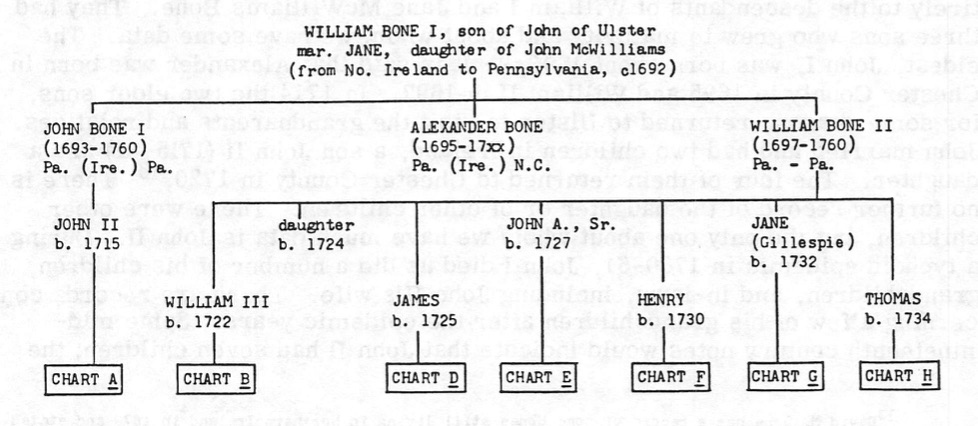

= Bone Surname Records in Madison and Muhlenberg Counties Kentucky
Michael Dean Baker <mbaker00@me.com>
:icons: font
:doctype: book
:hardbreaks:
:TOC:
:toclevels: 4
:media: prepress
:sectnums:
:stylesheet: medium.css

// command line to run asciidoctor with graphics
// asciidoctor -r asciidoctor-diagram Bones.adoc
// asciidoctor -r asciidoctor-diagram -r asciidoctor-pdf -b pdf Bones.adoc

== Background and Introduction
**In Progress: Edited 3/05/2019 MDB**

=== My Interest in Bone Family research
For several decades I have intermittently worked on my maternal grandmothers Bone family genealogy. Her mother's families were Bone and Bones in Western Kentucky. Early on I traced her family back through her grandfather Mark Lafayette Bone, his father John M. Bone and his father John Bone a Revolutionary War veteran who died in Muhlenberg County, Kentucky, in 1842. Information beyond the Veteran John Bone came primarily from a book by Dr. Robert Gehlman Bone; _A History of the Bone Family in America_ 1972.

After some years of research, I discovered there were errors in Dr. Bone's publication and the research he collected from contributors for John Bone and his family. One consequence of some of these errors has been a proliferation of mistaken dates and omitted historical information that has been copied online to so many family trees that new family researchers are likely to consider these dates and names correct despite some obvious errors. An example vital statistic that was a clear error is that John Bone, who was born in Pennsylvania in 1762 and moved through North Carolina and Tennessee then Madison and Muhlenberg Counties of Kentucky, died in 1832. This date should be 1842. The date given in Dr. Bone's history cannot be correct given various historical records. In a revision the same year he included a footnote to the 1842 date. Despite this, the majority of online trees still have an incorrect death date. Other errors and omissions regarding him and other relatives are present in the book. To solidify my conclusion and to offer records for others to evaluate and possibly come to the same conclusion, I have collected as many Bone family documents that I can from some counties of interest.

=== The Scope and Source of Records
The scope of this document widened from my original plan to cover my direct line only. It became necessary to expand into records of additional Bone branches due to the proximity of fathers, sons, and cousins of the same name in the same place and time. I have also tried to locate as many older references to early family historians as possible. Unfortunately much of the family tradition that Dr. Bone's book is based on is either not documented, lost, or destroyed.

To date, the records I have collected come primarily from North Carolina counties of Rowan and its daughter county Iredell, Madison County, Kentucky, and Muhlenberg County, Kentucky. The majority of records span 1750's and ending before 1850. I have found a few letters of correspondence regarding Bone family research from the mid to late 19th and early 20th century.

=== Strengths and Deficiencies of Dr. Bone's 1972 Publication
Doctor Bone's categorization of several branches of Bone families into charts labeled A, B, D, E, F, G, and H is useful to help differentiate the various proposed family lines and frequently reused given names. It is hoped that although Dr. Bone's work has some significant errors, that the majority of the work and the major lines can be relied on. However, we should not assume this baseline tree to be definitive. The base chart from his book is included here for reference.

.Family Chart of Bone Families Proposed by Dr. R.G. Bone

One deficiency of the research related to my line and some cousin lines is the blind spot encountered in records of Madison County, Kentucky. There are significant periods of time that some of these Bone families spend here that are not included in the history. Passages from the book claim families moving to Tennessee during the time they were actually in Kentucky. Other inconsistencies found multiple times is where a Bone veteran clearly states in his pension application where and when he moved between places and match the historical county and federal records but the biography provides a Significantly different timeline.

Significant errors in this important work should not be surprising nor should detract from the value this publication has. It would be impossible for Dr. Bone and the people who supplied him information to have all the information correct. The scope of his book is great and the records available today and ability to share between researchers probably far exceed what was available to him at the time. It is likely that those of us researching more narrow segments of our particular Bone family, when backed up by appropriate sources, can provide a better genealogy of this family than Dr. Bone was able to provide. He wisely states in the conclusion of his work the following:

[quote, Robert G. Bone, History of the Bone Family in America]
There are no doubt errors of omission and occasional errors in names and dates. Many of the charts have been compiled from lists sent by more than one descendant in a given line; some of the handwriting is difficult to decipher and some of the conscientious genealogists have copied from old Bibles and ancient records that were hard to read and my have, in a few cases, been copied in error. It is hoped that corrections will be noted so that the second volume and future re-editing can reflect the corrections. ... Rather than becoming unhappy about possible errors (and it is hoped that these will be pointed out), it is better to express our appreciation for the work of the Bone genealogists and family historians who have conscientiously compiled the above material.

To make any progress in correcting and adding to his publication, it seems necessary to assume the foundations his work is reliable and build on that. However, we cannot discount the possibility that large portions of our tree in the 17th through the 19th century are incorrect and that some day there may be enough data to consider other significant alterations.

=== Variations in the Bone surname
The researcher should consider searching for variants of the name so as not to miss important records. Variants of the name Bone include Bones, Boon, Boone, Boen, Boan, Boane, and Bowen. In one example case, a deed index showed an entry in a deed book F for a John Boone. Examining the document, it is clear that the index is in error and the Grantor is John Bone. Sometimes two versions of the name are present in one record. Some of the same problems exist for Boone family researches as more rarely their Boones are spelled Bone.

include::Bone_KY_Madison.adoc[]

include::Bone_KY_Muhlenberg.adoc[]

include::Bone_NC_Iredell.adoc[]

== Conclusion
I hope this collection of sources and notes from my research into this part and these locations related to the Bone family will be useful in answering some questions and furthering research of this family.

Questions to be answered:
- Are the parents of John Bone (1762 York, PA - 1842 Muhlenberg, KY) actually Thomas and Mary Bone?
- Is John Bone above the brother of Hugh Bone?
- What are the sources for the list of children proposed for Thomas and Mary Bone?
- Who is the other John Bone in Madison County, Kentucky?
- How might John Bone be related to the other Bones of Madison County, Kentucky?
- What records are there, if any, of John Bone in North Carolina or early Eastern Tennessee/Wester North Carolina?
- How many additional errors are there in the Bone Family History by Robert G. Bone?

There is still work to be done with these generation of Bones. Please share any additional information and original sources you might have regarding these. Thanks -
Michael Dean Baker [mbaker00@me.com](mailto:mbaker00@me.com)
